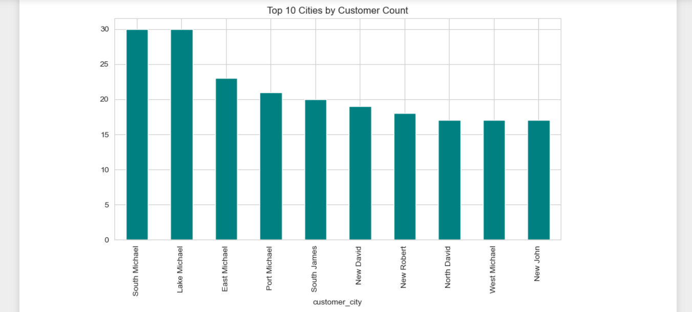
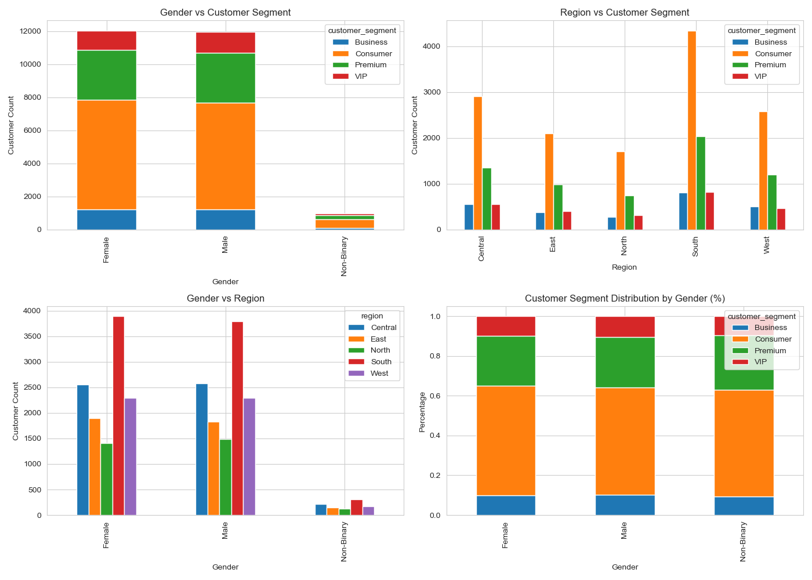
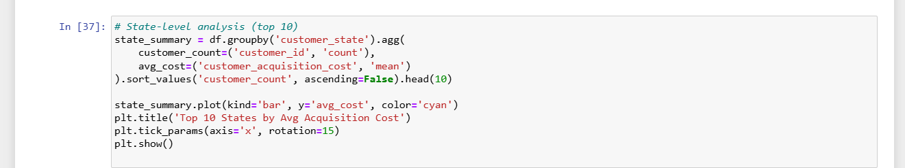

# 👥 Customer Master Data — Exploratory Data Analysis (EDA)

A comprehensive exploratory data analysis of a customer dataset containing **25,000 records** with 11 features. This project uncovers patterns in customer demographics, regional distribution, segmentation, and acquisition costs.

---

## 📌 Table of Contents

- [Project Overview](#-project-overview)
- [Dataset](#-dataset)
- [Tech Stack](#-tech-stack)
- [Project Workflow](#-project-workflow)
- [Key Findings](#-key-findings)
- [Visualizations](#-visualizations)
- [How to Run](#-how-to-run)
- [Project Structure](#-project-structure)
- [Next Steps](#-next-steps)
- [Author](#-author)

---

## 📖 Project Overview

This project performs **Exploratory Data Analysis (EDA)** on a customer dataset to answer key business questions:

- Who are our customers? (demographics)
- Where are they located? (geography)
- How are they segmented? (business value)
- How much does it cost to acquire them? (efficiency)

The goal is to uncover **actionable insights** that can inform marketing, sales, and customer retention strategies.

---

## 📊 Dataset

**File:** `customer_master.csv`

**Size:** 25,000 rows × 11 columns

| Column | Data Type | Description |
| :--- | :--- | :--- |
| `customer_id` | object | Unique customer identifier |
| `customer_name` | object | Full name of the customer |
| `customer_age` | int64 | Age in years |
| `gender` | object | Male / Female / Non-Binary |
| `customer_segment` | object | Business / Consumer / Premium / VIP |
| `customer_city` | object | City of residence |
| `customer_state` | object | State of residence |
| `customer_country` | object | Country of residence |
| `region` | object | Central / East / North / South / West |
| `customer_postal_code` | int64 | Postal code |
| `customer_acquisition_cost` | float64 | Cost to acquire the customer |

---

## 🛠️ Tech Stack

- **Python 3.x**
- **Pandas** — Data manipulation
- **NumPy** — Numerical operations
- **Matplotlib** — Base plotting
- **Seaborn** — Statistical visualizations

---

---

## 🔍 Key Findings

### 📌 Data Quality

| Check | Result |
| :--- | :--- |
| Unique IDs | ✅ True (all `customer_id` are unique) |
| Duplicate Rows | ✅ 0 |
| Duplicate Names | ⚠️ 3,369 (common names, not an error) |

### 📌 Demographics

- **Gender:** Male (~12,000) ≈ Female (~12,000); Non-Binary is underrepresented (~1,000)
- **Age:** Uniformly distributed between **18 and 70 years**
- **Segment:** Consumer dominates (~55%), followed by Premium (~25%), VIP (~10%), Business (~10%)

### 📌 Geography

- **Top Country:** USA (~14,925 customers) — ~60% of the customer base
- **Top Region:** South (~7,996 customers)
- **Lowest Region:** North (~3,022 customers)
- **Top States:** Pennsylvania, California, Georgia, New York, Ohio
- **Top Cities:** South Michael, Lake Michael, East Michael

### 📌 Acquisition Cost

- **Range:** ~10 to ~80 (uniform distribution)
- **Average:** ~42 across all regions and countries
- **Insight:** Acquisition cost is remarkably consistent — no region or country stands out as significantly cheaper or more expensive

### 📌 Cross-Tabulation Insights

| Analysis | Finding |
| :--- | :--- |
| Gender vs Segment | Nearly identical distribution across genders |
| Region vs Segment | Consumer dominates in every region |
| Gender vs Region | Both genders follow the same regional pattern |

**Conclusion:** Gender is **not** a differentiating factor for segmentation or region.

---

## 📈 Visualizations

### 1. Age & Acquisition Cost Distribution

- Age is uniformly distributed between 18–70
- Acquisition cost is uniformly distributed between 10–80

### 2. Customers by Gender & Segment

- Balanced gender split
- Consumer segment dominates

### 3. Average Acquisition Cost by Country

- Australia highest, UAE lowest
- Very narrow range (41.3 – 42.6)

### 4. Customers by Region

- South is the largest region
- North is the smallest

### 5. Cross-Tabulations (4-Panel View)

- Gender vs Segment
- Region vs Segment
- Gender vs Region
- Normalized Segment Distribution

### 6. Top 10 Postal Codes

- Fairly even distribution
- No dominant postal code

### 7. Top Cities by Customer Count

- South Michael and Lake Michael lead

---

